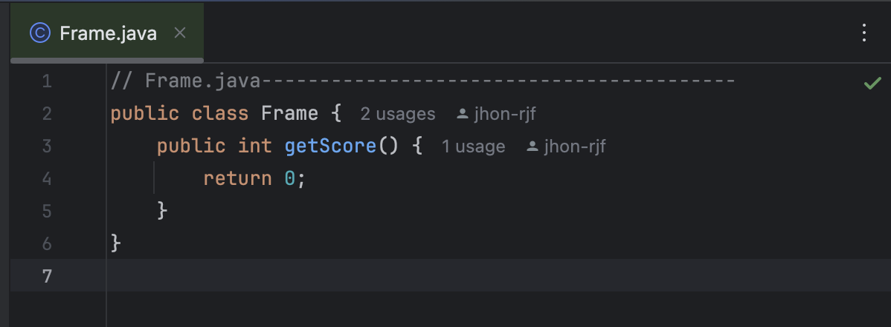

# unit test (Bowling game)

---

<aside>
💡 개발환경

**OS :** MacOS Sonoma 14.4.1(23E224)

**Processor :** 3 GHz 6코어 Intel Core i5

**통합개발환경 :** IntelliJ IDEA 2024.1.1 (Ultimate Edition)

</aside>

[How to Setup_unittest](https://github.com/jhon-rjf/unittest_bowling/blob/master/Settings_intelij_unittest.md)

# Frame, TestFrame, TestThrow

---

$$
\large\color{magenta}━━━━━━━━━━━━━━━━━━━━━━━━━━━━━━
$$

# add 메소드

---

frame에 add메소드가 없어서 뜨는 컴파일 오류

$$
\large\color{magenta}━━━━━━━━━━━━━━━━━━━━━━━━━━━━━━
$$

# 메소드 정의

---

$$
\large\color{magenta}━━━━━━━━━━━━━━━━━━━━━━━━━━━━━━
$$

# throw → pins

---

$$
\large\color{magenta}━━━━━━━━━━━━━━━━━━━━━━━━━━━━━━
$$

# TestGame, TestGame

---

$$
\large\color{magenta}━━━━━━━━━━━━━━━━━━━━━━━━━━━━━━
$$

# testTwoThrowsNoMark

---

$$
\large\color{magenta}━━━━━━━━━━━━━━━━━━━━━━━━━━━━━━
$$

# Four throws, add method

---

컴파일은 됐지만, 테스트는 실패

$$
\large\color{magenta}━━━━━━━━━━━━━━━━━━━━━━━━━━━━━━
$$

# 투구 횟수, 프레임 계산 (단순 더하기)

---

$$
\large\color{magenta}━━━━━━━━━━━━━━━━━━━━━━━━━━━━━━
$$

# refector. loop→ simple

---

$$
\large\color{magenta}━━━━━━━━━━━━━━━━━━━━━━━━━━━━━━
$$

# refector. 가독성 증진

---

$$
\large\color{magenta}━━━━━━━━━━━━━━━━━━━━━━━━━━━━━━
$$

# Spare test case

---

컴파일 성공, 테스트는 실패

$$
\large\color{magenta}━━━━━━━━━━━━━━━━━━━━━━━━━━━━━━
$$

# 동작 가능하게

---

> 47번 라인을 주석처리해서 돌아간다.  g.score의 문제. Pointer 가 이미 넘어가서 그렇다.
> 

1st commit

2nd commit - **add method 'add' in to Frame.java**

3rd commit - **throws -> pins**

4th commit - **edit TestGame.java - testTwoThrowsNoMark**

5th commit - **throws two -> throws four, add method 'scoreForFrame' in to Game.java**

6th commit - **check how many throw**

7th commit - **make loop simple**

8th commit - **increase 'ga-dok sung'**

9th commit -  **add Spare Test Case -> TestGame.java**

10th commit - **spare test case -> fix**

> 코드의 왼쪽이 변경전 오른쪽이 변경 후 입니다.
>
