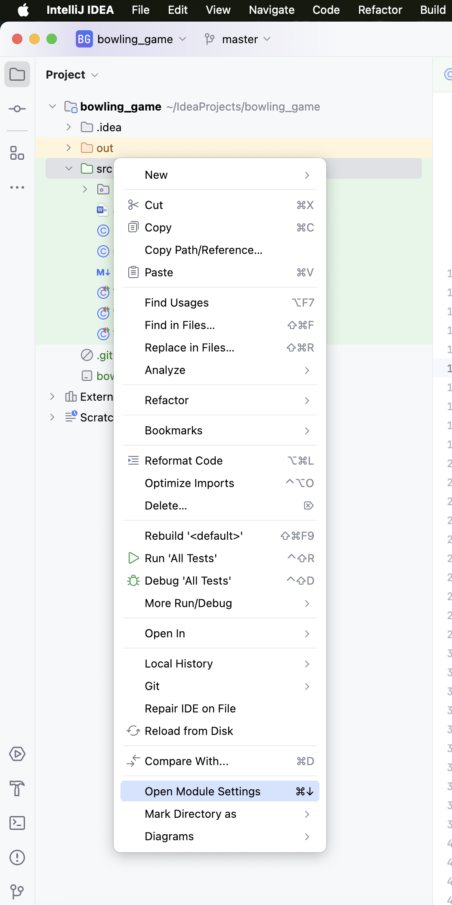

# 인텔리제이 단위테스트 방법

```java
import junit.framework.TestCase;
```

위 import를 사용하기 위해 이것저것 찾아봤었다.

1. right click the folder where you want to test - click module Settings
테스트 하려는 폴더를 우클릭 - open module settings
    
    
    
2. Module Settings (follow my mark)
모듈세팅(그림대로)


3. Right-click the class name you want to test - Go To - Test
클래스 우클릭 -goto - test


4. click Create New Test…


5. Create Test (Follow my mark)


> In my case, I had to use "import junction.framework.TestCase;", and Junit3 can import this. 
저같은 경우에 import junction.framework.TestCase; 이걸 사용해야 했는데, JUnit3가 지원했습니다.
> 
1. Done (you can see freen field)
초록색으로 바뀐걸 보면 끝


